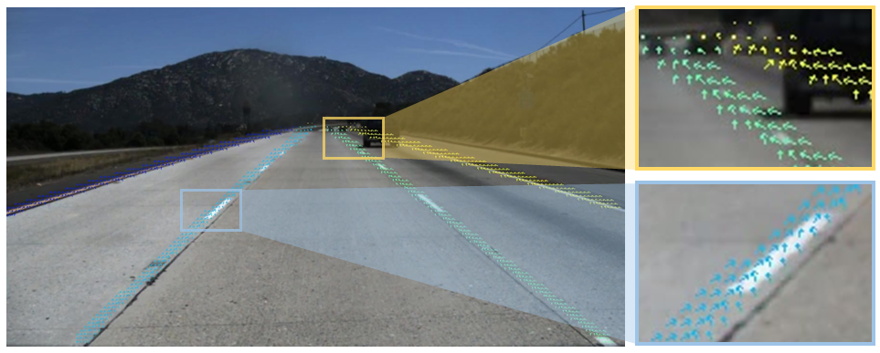

[](https://paperswithcode.com/sota/lane-detection-on-culane?p=laneaf-robust-multi-lane-detection-with)

[](https://paperswithcode.com/sota/lane-detection-on-llamas?p=laneaf-robust-multi-lane-detection-with)

# LaneAF: Robust Multi-Lane Detection with Affinity Fields

[Paper link](http://cvrr.ucsd.edu/publications/2021/LaneAF.pdf)

[Video results](https://youtube.com/playlist?list=PLUebh5NWCQUZv8IXYOVNM5SuRYQzScW5P)




## Overview
1) [Installation](#installation)
2) [TuSimple](#tusimple)
3) [CULane](#culane)
4) [Unsupervised Llamas](#unsupervised-llamas)
5) [Pre-trained Weights](#pre-trained-weights)
5) [Citation](#citation)

## Installation
1) Clone this repository
2) Install Anaconda
3) Create a virtual environment and install all dependencies:
```shell
conda create -n laneaf pip python=3.6
source activate laneaf
pip install numpy scipy matplotlib pillow scikit-learn
pip install opencv-python
pip install https://download.pytorch.org/whl/cu101/torch-1.7.0%2Bcu101-cp36-cp36m-linux_x86_64.whl
pip install https://download.pytorch.org/whl/cu101/torchvision-0.8.1%2Bcu101-cp36-cp36m-linux_x86_64.whl
source deactivate
```
You can alternately find your desired torch/torchvision wheel from [here](https://download.pytorch.org/whl/torch_stable.html).

4) Clone and make DCNv2:
```shell
cd models/dla
git clone https://github.com/lbin/DCNv2.git
cd DCNv2
./make.sh
```

## TuSimple
The entire [TuSimple dataset](https://github.com/TuSimple/tusimple-benchmark/issues/3) should be downloaded and organized as follows:
```plain
└── TuSimple/
    ├── clips/
    |   └── .
    |   └── .
    ├── label_data_0313.json
    ├── label_data_0531.json
    ├── label_data_0601.json
    ├── test_tasks_0627.json
    ├── test_baseline.json
    └── test_label.json
```
The model requires ground truth segmentation labels during training. You can generate these for the entire dataset as follows:
```shell
source activate laneaf # activate virtual environment
python datasets/tusimple.py --dataset-dir=/path/to/TuSimple/
source deactivate # exit virtual environment
```

### Training
LaneAF models can be trained on the TuSimple dataset as follows:
```shell
source activate laneaf # activate virtual environment
python train_tusimple.py --dataset-dir=/path/to/TuSimple/ --backbone=dla34 --random-transforms
source deactivate # exit virtual environment
```
Other supported backbones are `erfnet` and `enet`.

Config files, logs, results and snapshots from running the above scripts will be stored in the `LaneAF/experiments/tusimple` folder by default.

### Inference
Trained LaneAF models can be run on the TuSimple test set as follows:
```shell
source activate laneaf # activate virtual environment
python infer_tusimple.py --dataset-dir=/path/to/TuSimple/ --snapshot=/path/to/trained/model/snapshot --save-viz
source deactivate # exit virtual environment
```
This will generate outputs in the TuSimple format and also produce benchmark metrics using their [official implementation](https://github.com/TuSimple/tusimple-benchmark/tree/master/doc/lane_detection).

### Results
| Backbone | F1-score | Accuracy |   FP   |   FN   |
|:--------:|:--------:|:--------:|:------:|:------:|
|  DLA-34  |  96.4891 |  95.6172 | 0.0280 | 0.0418 |
|  ERFNet  |  94.9465 |  95.2978 | 0.0550 | 0.0465 |
|   ENet   |  92.8905 |  94.7271 | 0.0885 | 0.0560 |

## CULane
The entire [CULane dataset](https://xingangpan.github.io/projects/CULane.html) should be downloaded and organized as follows:
```plain
└── CULane/
    ├── driver_*_*frame/
    ├── laneseg_label_w16/
    ├── laneseg_label_w16_test/
    └── list/
```

### Training
LaneAF models can be trained on the CULane dataset as follows:
```shell
source activate laneaf # activate virtual environment
python train_culane.py --dataset-dir=/path/to/CULane/ --backbone=dla34 --random-transforms
source deactivate # exit virtual environment
```
Other supported backbones are `erfnet` and `enet`.

Config files, logs, results and snapshots from running the above scripts will be stored in the `LaneAF/experiments/culane` folder by default.

### Inference
Trained LaneAF models can be run on the CULane test set as follows:
```shell
source activate laneaf # activate virtual environment
python infer_culane.py --dataset-dir=/path/to/CULane/ --snapshot=/path/to/trained/model/snapshot --save-viz
source deactivate # exit virtual environment
```
This will generate outputs in the CULane format. You can then use their [official code](https://github.com/XingangPan/SCNN) to evaluate the model on the CULane benchmark.

### Results
| Backbone | Total | Normal | Crowded | Dazzle | Shadow | No line | Arrow | Curve | Cross | Night |
|:--------:|:-----:|:------:|:-------:|:------:|:------:|:-------:|:-----:|:-----:|:-----:|:-----:|
|  DLA-34  | 77.41 |  91.80 |  75.61  |  71.78 |  79.12 |  51.38  | 86.88 | 71.70 |  1360 | 73.03 |
|  ERFNet  | 75.63 |  91.10 |  73.32  |  69.71 |  75.81 |  50.62  | 86.86 | 65.02 |  1844 | 70.90 |
|   ENet   | 74.24 |  90.12 |  72.19  |  68.70 |  76.34 |  49.13  | 85.13 | 64.40 |  1934 | 68.67 |

## Unsupervised Llamas
The [Unsupervised Llamas dataset](https://unsupervised-llamas.com/llamas/index) should be downloaded and organized as follows:
```plain
└── Llamas/
    ├── color_images/
    |   ├── train/
    |   ├── valid/
    |   └── test/
    └── labels/
        ├── train/
        └── valid/
```

### Training
LaneAF models can be trained on the Llamas dataset as follows:
```shell
source activate laneaf # activate virtual environment
python train_llamas.py --dataset-dir=/path/to/Llamas/ --backbone=dla34 --random-transforms
source deactivate # exit virtual environment
```
Other supported backbones are `erfnet` and `enet`.

Config files, logs, results and snapshots from running the above scripts will be stored in the `LaneAF/experiments/llamas` folder by default.

### Inference
Trained LaneAF models can be run on the Llamas test set as follows:
```shell
source activate laneaf # activate virtual environment
python infer_llamas.py --dataset-dir=/path/to/Llamas/ --snapshot=/path/to/trained/model/snapshot --save-viz
source deactivate # exit virtual environment
```
This will generate outputs in the CULane format and Llamas format for the Lane Approximations benchmark. 
Note that the results produced in the Llamas format could be inaccurate because we *guess* the IDs of the indivudal lanes. 

### Results
| Backbone | F1-score | Precision | Recall |   TP  |  FP  |  FN  |
|:--------:|:--------:|:---------:|:------:|:-----:|:----:|:----:|
|  DLA-34  |   96.01  |   96.91   |  95.26 | 71793 | 2291 | 3576 |
|  ERFNet  |     NA   |     NA    |    NA  |   NA  |  NA  |  NA  |
|   ENet   |     NA   |     NA    |    NA  |   NA  |  NA  |  NA  |

## Pre-trained Weights 
You can download our pre-trained model weights using [this link](https://drive.google.com/file/d/1GJoVQfDyxhUT8Y5EqTRV9PX3WWckfxWG/view?usp=sharing).

## Citation
If you find our code and/or models useful in your research, please consider citing the following papers:

    @article{abualsaud2021laneaf,
    title={LaneAF: Robust Multi-Lane Detection with Affinity Fields},
    author={Abualsaud, Hala and Liu, Sean and Lu, David and Situ, Kenny and Rangesh, Akshay and Trivedi, Mohan M},
    journal={arXiv preprint arXiv:2103.12040},
    year={2021}
    }

